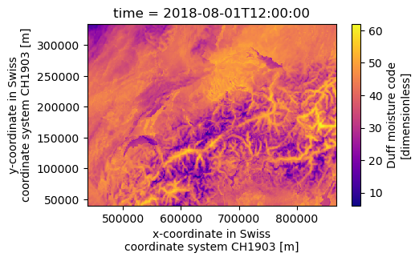

###########################
FireDanger - Forest Fire Danger 
###########################
==================================================================================
Calculation of indices for forest fire risk assessment in weather and climate data
==================================================================================

**IMPORTANT** - June, 2021:  This tool is still under development and not yet intended for use!! 

FireDanger is a Python package intended to simpify the process of analysing forest fire (and drought) in time series and gridded weather and climate datasets. It is built on top of `xarray`_.  
It contains implementations of several popular fire danger and drought indices calculated from meteorological parameters:

- Canadian Fire Weather Index System (FWI) including all its 6 components

Coming up next:  

- Angström Index  
- Baumgartner Index  
- Nesterov index  
- Munger Drought index  
- Fuel Moisture Index  
- Fosberg Fire Weather Index  
- Keetch-Byram Drought Index  
- McArthur Mark 5 Forest Fire Danger Index  

The package is developed as part of the project "Waldbrandmanagement auf der Alpennordseite" by the `University of Bern <https://www.geography.unibe.ch/about_us/staff/dr_steinfeld_daniel/index_eng.html>`_.  
A big "thank you" to the `Swiss federal institute of forest, snow and landscape research WSL <https://www.wsl.ch/en/index.html>`_ for providing a public `WIKI <https://wikifire.wsl.ch/tiki-index.html>`_ with reference information on the mostly used fire weather indices.

..
  References
.. _xarray: https://xarray.pydata.org/en/stable/

Be aware that this is a free scientific tool in continous development, then it may not be free of bugs. Please report any issue on the GitHub portal.

============
Installation
============

Make sure you have the required dependencies (for details see docs/environment.yml):

- xarray
- pandas
- numpy
- netCDF4
- numba
- (for plotting on geographical maps: matplotlib and cartopy)
- (for parallel computing: dask)
 
To install the development version (master), do:

.. code:: bash

    pip install git+https://github.com/steidani/firedanger.git

Copy code from Github repository
--------------------------------

Copy/clone locally the latest version from FireDanger:

.. code-block:: bash

    git clone git@github.com:steidani/firedanger.git /path/to/local/firedanger
    cd path/to/local/firedanger

Prepare the conda environment:

.. code-block:: bash

    conda create -y -q -n firedanger_dev python=3.8.5 pytest
    conda env update -q -f environment.yml -n firedanger_dev

Install firedanger in development mode in firedanger_dev:

.. code-block:: bash

    conda activate firedanger_dev
    pip install -e .

Run the tests:

.. code-block:: bash

    python -m pytest

==========
Tutorial
==========

Calculate Canadian Forest Fire Danger Rating System
---------------------------------------------------

**Example for time series (csv):**

.. code-block:: python 

   # import firedanger module 
   from firedanger import firedanger

   # initiate instance and read time series (measurement) from weather station 
   # measurements are taken daily at 12 noon from 19910501 to 19911130.
   fire = firedanger('data/measurement.csv')
   print(fire)
   # Out[]:	Xarray dataset with 214 time steps.
   #            Available fields: index, stn, T, P, H, U

   # no preprocessing needed: data is already measured at 12 noon

   # calculate Canadian Forest Fire Weather Indices
   fire.calc_canadian_fwi(temp="T", precip="P", hum="H", wind="U")
   print(fire)
   # Out[]:	Xarray dataset with 214 time steps. 
   #            Available fields: index, stn, T, P, H, U, ffmc, dmc, dc, isi, bui, fwi

   # save to disk as csv
   fire.to_dataframe().to_csv("data/measurement_fire.csv")

   # plot temporal evolution of Duff Moisutre Code
   fire.dmc.plot()
   plt.show()

**Example for gridded weather data (netcdf):**

.. code-block:: python 
   
   # import firedanger module 
   from firedanger import firedanger

   # initiate instance
   fire = firedanger()
   
   # read gridded COSMO-1 analysis hourly data from 20180801_00 to 20180814_03 with 0.01° (~1 km) spatial resolution)
   fire.read_nc('data/cosmo-1_ana.nc')
   print(fire)
   # Out[]:	Xarray dataset with 316 time steps. 
   #	        Available fields: TOT_PREC, T_2M, U_10M, V_10M, RELHUM_2M

   # preprocessing: select only time at 12 noon
   fire.ds = fire.ds.sel(time=datetime.time(12))
   # xarray.Dataset (and all its functions) can be accessed with fire.ds
  
   # preprocessing: calculate wind speed
   fire.calc_windspeed(u="U_10M", v="V_10M")
   # creates new variable "wind"

   # Hint: Use fire.set_up(...) to do consistency check and set (automatically or manually) names of dimension ('time', 'latitude', 'longitude')

   # calculate Canadian Forest Fire Weather Indices
   fire.calc_canadian_fwi(temp="T_2M", precip="TOT_PREC", hum="RELHUM_2M", wind="wind")
   print(fire)
   # Out[]:	Xarray dataset with 13 time steps. 
   #	        Available fields: TOT_PREC, T_2M, U_10M, V_10M, RELHUM_2M, wind, ffmc, dmc, dc, isi, bui, fwi

   # save to disk
   fire.to_netcdf('data/cosmo-1_daily_fire.nc')

   # plot Duff Moisture Code at one timestep
   fire.dmc[0].plot(cmap="plasma")
   plt.show()

